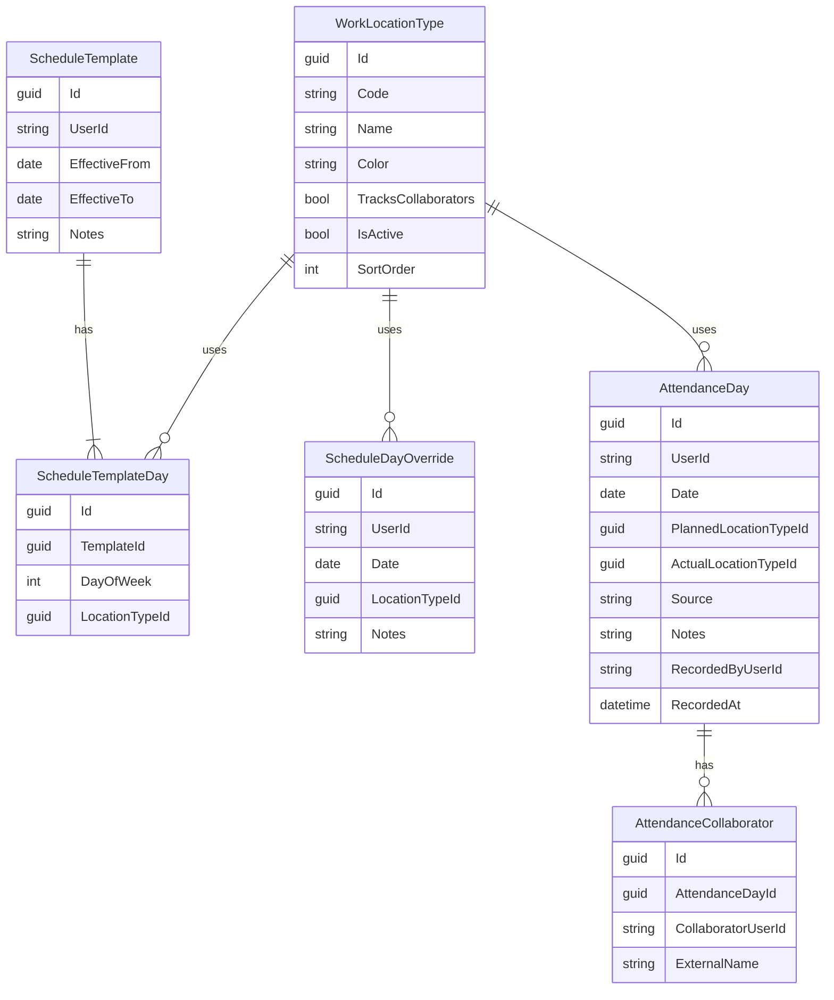

# Leave Attendance & Schedule — Implementation Plan

## Overview

Phased roadmap to add **hybrid workforce schedule management** and **planned vs actual attendance** inside the existing Leave management app (`/leave`). Follows modular monolith rules ([ADR 0001](./adr/0001-module-boundaries.md)) and current Leave patterns (permissions, `IOrgDirectory` visibility, Admin/HR on-behalf).

**Goal:** managers and employees can plan where people work (office, WFH, client site, business travel, etc.), record actual attendance day-to-day, compare planned vs actual, and optionally track WFH collaborators.

Parent leave docs: [leave-module-implementation-plan.md](./leave-module-implementation-plan.md), [leave-management.md](./leave-management.md). Wishlist: [system-wishlist.md](./system-wishlist.md) (Attendance & Time Tracking).

---

## Locked product decisions

These defaults drive the design (adjust here if product changes):

| Decision | Choice |
|----------|--------|
| Module home | Extend **Leave** (same launcher app, nav, backend module) — not a separate Aspire app |
| Planned schedule | **Weekly recurring templates** per employee + **day overrides** |
| Actual attendance | **Both:** employee self-declares; Manager / HR / Admin can override or correct |
| WFH collaborators | **Internal CarTrack users** + **free-text external contacts** (client names, etc.) |
| Leave interaction | **Approved leave** (and pending display) wins over planned work location for that day |
| Time clocks / biometrics | **Out of scope** for this plan |
| Payroll hours export | **Deferred** (read model only; no payroll posting) |

---

## Current state (July 2026)

| Area | What exists |
|------|-------------|
| Leave module | `Modules/CarTrack.Modules.Leave` + `frontend/src/modules/leave` |
| Working days | Fixed Mon–Fri minus public holidays (`LeaveWorkingDaysService`) — no `WorkSchedule` entity |
| Team calendar | Month grid of pending/approved leave (`LeaveCalendarPage`, `LeaveCalendarService`) |
| Visibility | Self / reports / same department / Admin bypass / HR elevate (`LeaveVisibility`) |
| Org directory | Manager hierarchy + staff org info via `IOrgDirectory` |
| Attendance / WFH | **Not implemented** (deferred in leave plan; wishlist item only) |

---

## Product scope

### In scope (Phases 0–4)

- Configurable **work location types** (seeded: Office, Work from home, Client site, Business travel, Other)
- Per-employee **weekly schedule templates** (Mon–Sun slots → location type)
- **Day overrides** (exception dates without changing the template)
- **Actual attendance** day records (location + optional notes + source: Self / Manager / HR)
- **Planned vs actual** views (day / week / team)
- When actual or planned location is **WFH**: optional **collaborators** (internal user IDs + external free-text names)
- Admin/HR (and managers for reports) can set schedules and correct attendance **on behalf**
- Permissions, audit hooks, calendar/list UX in Leave nav
- Overlay **approved leave** on schedule/attendance views

### Out of scope / deferred

| Idea | Why deferred |
|------|----------------|
| Biometric / badge / GPS check-in | Hardware & privacy |
| Clock-in / clock-out hours & overtime | Separate time-tracking product |
| Shift bidding / rota optimization | Complexity |
| Automatic geo-fencing validation | Mobile + compliance |
| Payroll / timesheet posting | Needs Payroll module contract |
| Teams/Slack presence sync | External integrations |
| Changing leave Mon–Fri calendar from schedules | Optional later; leave accrual stays holiday-based unless explicitly revised |

---

## Architecture decisions

1. **Stay in Leave module**
   - Backend entities in `LeaveDbContext` (new tables; same `__EFMigrationsHistory_Leave`)
   - Frontend routes under `/leave/schedule` and `/leave/attendance`
   - Permissions: `leave.schedule.{read,write}`, `leave.attendance.{read,write}` (+ optional `leave.locations.write` for HR config)

2. **Opaque user IDs** — same as leave requests; resolve display names via `IOrgDirectory` / Users APIs. No FK to AspNetUsers.

3. **Two layers of truth**
   - **Planned:** template + overrides → resolved location for a date
   - **Actual:** explicit `AttendanceDay` row when declared/overridden; missing actual = “not confirmed”

4. **Resolution order for “effective planned location” on a date**
   1. Approved leave covering the date → treat as **On leave** (not a work location)
   2. Day override if present
   3. Else weekday from active weekly template
   4. Else **Unscheduled**

5. **Visibility** — reuse `LeaveVisibility` / manager reports / department / Admin bypass / HR role (same as calendar & requests). Staff see self; managers see reports; HR/Admin see all.

6. **No separate approval workflow for schedule changes in MVP** — writers with permission apply immediately; audit log who changed what. (Optional manager acknowledgement later.)

---

## Domain model

### Notes

- `WorkLocationType.TracksCollaborators` — true for WFH (and optionally Client site); UI requires/allows collaborator fields when set.
- `AttendanceDay.PlannedLocationTypeId` — snapshot at confirm time (or null if resolved as On leave / Unscheduled) so historical planned vs actual stays stable if templates change later.
- Collaborator rows: either `CollaboratorUserId` **or** `ExternalName` (not both empty).
- `Source`: `Self` | `Manager` | `Hr` | `Admin` (string constants, same style as leave statuses).

---

## API surface (proposed)

Base: `/api/leave` (extend [`LeaveEndpoints.cs`](../Modules/CarTrack.Modules.Leave/LeaveEndpoints.cs))

| Method | Route | Permission | Purpose |
|--------|-------|------------|---------|
| `GET/POST/PUT` | `/locations` | policies/schedule read; write for HR | Location type CRUD |
| `GET` | `/schedule/templates?userId=` | `leave.schedule.read` | Active (+ history) templates |
| `PUT` | `/schedule/templates` | `leave.schedule.write` | Upsert template (self or on-behalf) |
| `GET/PUT/DELETE` | `/schedule/overrides` | schedule read/write | Day overrides |
| `GET` | `/schedule/resolved?from=&to=&userId=` | `leave.schedule.read` | Resolved planned days (+ leave overlay) |
| `GET` | `/attendance?from=&to=&userId=` | `leave.attendance.read` | Actual rows |
| `PUT` | `/attendance/{date}` | `leave.attendance.write` | Self or on-behalf declare/correct |
| `GET` | `/attendance/compare?from=&to=` | attendance + schedule read | Team planned vs actual matrix |

On-behalf rules: same as leave create-on-behalf — **Admin / SystemAdmin / HR** for any user; **Manager** limited to `ReportUserIds` for schedule write and attendance override.

---

## Frontend UX

### Nav ([`frontend/src/modules/leave/index.tsx`](../frontend/src/modules/leave/index.tsx))

Add:

| Path | Label | Permission |
|------|-------|------------|
| `/leave/schedule` | Schedule | `leave.schedule.read` |
| `/leave/attendance` | Attendance | `leave.attendance.read` |

Optional later: location types under **Policies** tab, or a small “Locations” subsection on Policies page.

### Screens

1. **My Schedule** — week editor (7 day chips → location); effective-from; list of overrides; “copy week to team” deferred.
2. **Team Schedule** (manager/HR) — week grid of planned locations by person; filters dept/branch (reuse calendar filters).
3. **Attendance (today / week)** — confirm or change actual location; if location tracks collaborators, show multi-select users + external name chips.
4. **Planned vs Actual** — table or calendar: Planned | Actual | Match? | Collaborators; mismatch highlighting.
5. **Calendar integration** — optional badges on existing team leave calendar for “in office / WFH” (Phase 3+); Phase 1 can stay on dedicated pages.

Reuse: Fluent DataGrid patterns, `usePermissions`, employee picker from leave create-on-behalf, Upcoming holidays rail layout unchanged.

---

## Permissions & roles

Add to [`PermissionCatalog.cs`](../Shared/CarTrack.Identity/Users/PermissionCatalog.cs):

- `leave.schedule.read` / `leave.schedule.write`
- `leave.attendance.read` / `leave.attendance.write`

Role defaults (align with leave):

| Role | Grant |
|------|--------|
| Staff / Driver | schedule + attendance **read/write** (self only via RLS) |
| Manager | + write for reports; team compare read |
| HR / Admin / SystemAdmin | full |

Seed via existing permission seeder so new keys land on roles.

---

## Phased delivery

### Phase 0 — Foundation

- Entities + EF migration on Leave DbContext
- Seed location types (Office, WorkFromHome, ClientSite, BusinessTravel, Other; WFH has `TracksCollaborators = true`)
- Permission keys + role grants
- Service stubs + empty frontend routes/nav

### Phase 1 — Schedule management

- Template + override CRUD APIs
- Resolved schedule endpoint (with approved leave overlay)
- My Schedule + Team Schedule UI
- Admin/HR/Manager on-behalf schedule edit

### Phase 2 — Actual attendance + collaborators

- AttendanceDay upsert API + collaborator persistence
- Self check-in UI (“Confirm today” / edit week)
- Manager/HR override
- Snapshot planned location at confirm time

### Phase 3 — Planned vs actual

- Compare API + mismatch filters
- Attendance page: Match / Mismatch / Missing actual
- Optional export CSV (same pattern as leave reports)

### Phase 4 — Calendar polish & ops

- Leave calendar badges for planned location (non-leave days)
- Audit events (`leave.schedule.updated`, `leave.attendance.recorded`)
- Docs update + light architecture tests (module boundary)

---

## Cross-cutting rules

- **Weekends / holidays:** templates may still assign locations (hybrid weekends rare); UI shows public holidays as context (reuse holiday APIs). Actual attendance allowed on any date unless product later blocks holidays.
- **Half-day leave:** if leave covers morning/afternoon only, MVP treats full calendar day as On leave for schedule resolution; refine later if needed.
- **Privacy:** collaborator lists visible under same visibility as attendance rows (not world-readable).
- **Idempotency:** one `AttendanceDay` per `(UserId, Date)`; upsert replaces collaborators set.

---

## Key files to extend

| Layer | Files |
|-------|--------|
| Backend | [`LeaveDbContext.cs`](../Modules/CarTrack.Modules.Leave/Persistence/LeaveDbContext.cs), new `Domain/*`, `Features/Schedule*`, `Features/Attendance*`, [`LeaveEndpoints.cs`](../Modules/CarTrack.Modules.Leave/LeaveEndpoints.cs), [`LeaveModule.cs`](../Modules/CarTrack.Modules.Leave/LeaveModule.cs) |
| Auth | [`PermissionCatalog.cs`](../Shared/CarTrack.Identity/Users/PermissionCatalog.cs), Users permission seeder |
| Frontend | [`index.tsx`](../frontend/src/modules/leave/index.tsx), new pages/components/services under `modules/leave`, [`LeaveVisibility`](../Modules/CarTrack.Modules.Leave/Features/LeaveVisibility.cs) reuse |
| Docs | This file; link from leave-module plan “deferred WorkSchedule” section when implementing |

---

## Success criteria

- Employee can maintain a weekly hybrid template and day overrides
- Employee can confirm actual location; WFH can list internal + external collaborators
- Manager/HR can view team planned vs actual and correct records
- Approved leave days show as On leave, not as a false mismatch against Office/WFH
- Permissions and visibility match existing Leave security model

---

## Open follow-ups (non-blocking)

- Whether Policies page hosts location-type admin or a dedicated settings card
- Whether “missing actual” after N days should notify managers (notifications module)
- Whether leave working-day calculation should later consume schedules (today remains Mon–Fri + holidays)
